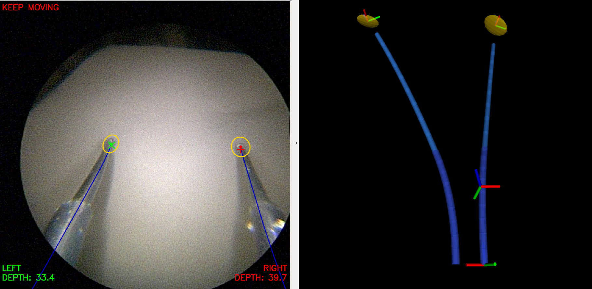

# Description

Implements online calibration, 3D tracking, tip force estimation, and visual servoing for the Virtuoso robot.
State estimation is accomplished by fusing data from both the endoscope camera and the robotic actuators (tube rotations/translations) across time to estimate the most likely current state of the system.



In the endoscope view above, you can see the measured pixel locations from JHU's learned keypoint model (crosses).
`smoother_uterus` fuses these 2D data points with a probabilistic 3D model of the robot to predict the tool tip pixel distributions (dots/ellipses). 
The 3D tube backbones are also projected onto the rectified image (blue curves).
In the 3D view, you see models of the two arms, the calibrated camera pose, as well as the tip position uncertainty regions (gold).

## Authors
* James Ferguson (j.m.ferguson@utah.edu)
* Brendan Burkhart (bburkha4@jhu.edu)
* Joshua Petrin (joshua.m.petrin@vanderbilt.edu)

## `smoother_uterus` node

The `smoother_uterus` node builds and solves factor graphs using GTSAM, for efficient, real time state estimation.

There are two processes that run continuously, and in parallel in the `smoother_uterus` node. 
Both take as input the robot joint values and the current camera image.

1. The calibrator reasons over all past data to estimate the most likely parameters for: **left arm base pose**, **right arm base pose**, and **all tube curvatures**.

2. The tracker continuously tracks the shape and the tip forces of both arms in real time, given the current best calibration from the calibrator.

### Subscribes To:

**NOTE**: We list all topic names with `<side>` where `<side>` can be either `left` or `right` for each of the two arms.
Every input topic name is a ROS parameter (in parentheses); defaults are for the uterine robot.

Requires the joint positions of both arms for kinematics computations, published by `motor_node` as `[inner_rotation, outer_rotation, inner_translation, outer_translation]` (rad, m):

* `/robot/<side>/joint/measured_jp`, `sensor_msgs/JointState` (`left_joint_state_topic`, `right_joint_state_topic`)

Requires the **rectified** camera image for tool tip identification with the ONNX keypoint model:

* `/camera/image_rect`, `sensor_msgs/Image` (`image_topic`)

Additionally requires the camera matrix for projecting 2D pixels to 3D:

* `/camera/camera_info`, `sensor_msgs/CameraInfo` (`camera_info_topic`)

The model assumes the camera is fixed relative to the arms. If the camera motor angle changes, the node warns:

* `/robot/camera/joint/measured_jp`, `sensor_msgs/JointState` (`camera_joint_state_topic`)

To signal that calibration is complete and lock in the current estimate (typically sent automatically by `mover_uterus`):

* `/smoother_uterus/stop_calibration`, `std_msgs/Empty`

### Publishes To:

**NOTE**: all tip poses, pixel tool tips, etc. take into account the **tool tip z offset** (e.g. spatula vs. probe).

All estimated poses of interest are published relative to `smoother_uterus/camera`:

* `/smoother_uterus/<side>/tip_pose`, `PoseWithCovarianceStamped`
* `/smoother_uterus/<side>/base_pose`, `PoseWithCovarianceStamped`

The covariance part of the message follows GTSAM’s rotation-first convention, i.e., the upper-left 3×3 block corresponds to rotational uncertainty, and the lower-right 3×3 block corresponds to positional uncertainty.
The covariance is marginalized in the camera frame — if you need it expressed in another frame, it must be transformed (see *State Estimation for Robotics 2nd Edition 8.3.5*).

In addition to the above, we also publish the poses comprising each tube of each arm (e.g. for visualization):

* `/smoother_uterus/<side>/outer/poses`, `PoseArray`
* `/smoother_uterus/<side>/inner/poses`, `PoseArray`

Estimated tip forces are published relative to `smoother_uterus/camera`:

* `/smoother_uterus/<side>/tip_force`, `PoseWithCovarianceStamped`

The 3D mean force is written to the `position` field of the message, and the 3x3 covariance matrix is just the upper left block of the `covariance` field.
Note that the forces will be small when you are not in estimate forces mode (see parameters).

The predicted pixel locations and camera z depth values are also available (even if the tip of the robot is occluded).
For this, we use `PoseWithCovarianceStamped` as a convenient container message type:

* `/smoother_uterus/<side>/tool_tip_pixels`, `PoseWithCovarianceStamped`

The pixel locations are available at `pose.pose.position.x` and `pose.pose.position.y`.
The camera depth z coordinate is at `pose.pose.position.z`.
The corresponding covariance is in the `pose.covariance` field in the top left 3x3 block.

We also publish the following jacobians, which relate joint state speeds to tip velocities, relative to `smoother_uterus/camera` frame:

* `/smoother_uterus/<side>/jac_tip_pose`, `Float64MultiArray`

These are 6x4 row major, with the top three rows corresponding to angular velocity and the bottom three for linear velocity.
These are mainly for the `visual_servoing` action server, but can be used elsewhere. 

### TF Broadcasters

The four main output poses are also broadcast as TF transforms. 
Each transform is published relative to the `smoother_uterus/camera` frame:

* `smoother_uterus/<side>/tip`
* `smoother_uterus/<side>/base`

Note that TF does not support uncertainty, so if you need covariance, you need to subscribe to the pose messages instead.

## `visual_servoing` action server

Listens for incoming requests to move the robot, e.g. from `mover_uterus` action clients.
When an action request is received, the server attempts to drive the estimated tool tips along the commanded trajectories, closing the loop on error.

The server listens for `VisualServo` action requests at `/visual_servoing/visual_servo`.
See the full documentation of the action type in the action/msg files themselves in `aliss_ros_msg`.

### Subscribes To:

Requires proprioception output in order to halt motion if/when a touch is detected:

* `/touch_sensor/sensor_output`, `aliss_ros_msg/TouchSensor`

In order to initialize commanded joint values, we need the joint states and the robot's current command:

* `/robot/<side>/joint/measured_jp`, `JointState`
* `/robot/state/current_state`, `Float32MultiArray`

### Publishes To:

Joint commands for both arms in one message, `[R_ir, R_or, R_it, R_ot, L_ir, L_or, L_it, L_ot]` (arms without waypoints are held at their current command):

* `/robot/state/current_state`, `Float32MultiArray`

Measured pose relative to camera for visual servoing error computation:

* `/smoother_uterus/<side>/tip_pose`, `PoseWithCovarianceStamped`

Jacobians are needed for velocity control:

* `/smoother_uterus/<side>/jac_tip_pose`, `Float64MultiArray`

## API changes

* 11/20/2025: All inference now takes place in this repository. The `tip_tracking` node **should no longer be used**. This requires potentially installing CUDA/CUDNN (see below).

* 01/21/2026: Add automatic visual servoing calibration. The `visual_servoing` action server was moved from its own separate repository into this one. The action client now lives in the `mover_uterus` repository.

# Uterine robot integration

Ported from the Virtuoso setup. What changed and what the robot side must provide:

* **Joint states**: `motor_node` publishes `/robot/<side>/joint/measured_jp` (last command + keyboard offset by default, or Dynamixel read-back with `joint_readback:=true`) and republishes at `joint_state_rate_hz` (30 Hz) so every image has a matching joint state.
* **Commands**: `visual_servoing` publishes the combined 8-joint command on `/robot/state/current_state`, seeded from the last command seen on that topic so keyboard offsets are not double counted. Anything else that commands the robot (e.g. the `/xyz_l`, `/xyz_r` IK) must not publish during a servo action, and should start from the last command on that topic afterwards or it will snap the other arm back.
* **Camera**: the robot publishes raw frames on `/image`. The smoother needs an intrinsic calibration, a `CameraInfo` stream and rectified images (e.g. `image_proc` rectify) on `image_topic` / `camera_info_topic`. The camera motor must stay fixed while the smoother runs (`motor_node` param `camera_tracking:=false` if tracking is ever enabled).
* **Geometry** (`smoother_uterus/src/solver/SmootherSolver.cpp`): camera below the tools (signs of `ENDO_BASE_Y_OFFSET` and `CAMERA_ANGLE` flipped, `ARM_BASE_YAW = 0` because `outer_rot = 0` bends toward the camera on this robot), outer curvature nominal 90 1/m from `motor_node`'s FK, no straight outer tip or clearance tilt. Values tagged `MEASURE`/`CHECK` still come from the Virtuoso.
* **Keypoint model**: `models/keypoint_rcnn.onnx` was trained on Virtuoso images (labels 1 = left tip, 2 = right tip). Retrain on uterine robot frames; any input resolution is accepted now.
* **Frames**: the launch file publishes static TFs `smoother_uterus/<side>/base -> hy/<side>/fwkin` (yaw -90 deg), the frame of `motor_node`'s `/fwkin_<l,r>` and of the diffusion trajectories.
* **Calibrations**: saved Virtuoso calibration files are not valid on this robot; recalibrate with `mover_uterus`.

# Install 

## Hardware dependencies

You must have:

* NVidia GPU
* `motor_node` publishing joint values
* Endoscope camera publishing rectified images and camera info
* A good intrinsic calibration, since errors are minimized between the 3D model and the 2D pixel measurements. 


## Local Build Setup

### OS requirements

* CUDA v12: this is the default version for Ubuntu 24.04 so it is likely already installed. 
If not, you may need to `sudo apt update && sudo apt install nvidia-cuda-toolkit`.
Note that if you _do_ already have another version of CUDA installed, you can easily install CUDA 12 side-by-side with the existing version by using the [CUDA Toolkit runfile installer](https://developer.nvidia.com/cuda-12-9-1-download-archive?target_os=Linux&target_arch=x86_64&Distribution=Ubuntu&target_version=24.04&target_type=runfile_local) (*not* the CUDA Debian/apt package).

* cuDNN v9: this may already be installed as well; you can check by searching for `cudnn.h` in `/usr` or by running `apt list --installed | grep cudnn`. 
If it is not installed, you will get a library load error when running, since ONNX requires it at runtime for the keypoint model. 
To install, reference [Nvidia's cuDNN installation instructions.](https://docs.nvidia.com/deeplearning/cudnn/installation/latest/linux.html)

* `git lfs` for pulling model weights from git, an alternative to downloading them from Box. If you don't already have it, install [git-lfs](https://git-lfs.com/): `sudo apt update && sudo apt install git-lfs`, and initialize it by running `git lfs install` to activate the LFS extension.

### ALISS dependencies
* https://github.com/ALISS-ARPAH/aliss_camera
* https://github.com/ALISS-ARPAH/ves-ros-interface
* https://github.com/ALISS-ARPAH/aliss_ros_msg

### Compilation

Clone this repository into your ROS2 workspace and pull the keypoint model weights:

``` bash
cd ~/<your_ros_workspace>/src
git clone https://github.com/ALISS-ARPAH/smoother_uterus.git
cd smoother_uterus
git lfs pull
```

At this point, you should be able to build this package.

``` bash
colcon build --cmake-args -DCMAKE_BUILD_TYPE=Release
```

**GTSAM**: If GTSAM 4.3 is already installed on the machine (e.g. at `/usr/local`), CMake will use it directly for fast builds. Otherwise CMake will automatically fetch and build GTSAM 4.3a1 from source — this only happens on a clean build and can take 10–15 minutes the first time.

To install GTSAM 4.3 once on a new machine (recommended for machines that also do standalone GTSAM development):

```bash
sudo apt install libtbb-dev
git clone --depth 1 --branch 4.3a1 https://github.com/borglab/gtsam.git /tmp/gtsam
cmake -B /tmp/gtsam/build -S /tmp/gtsam \
    -DCMAKE_BUILD_TYPE=Release -DGTSAM_WITH_TBB=ON \
    -DGTSAM_BUILD_TESTS=OFF -DGTSAM_BUILD_PYTHON=OFF \
    -DGTSAM_BUILD_EXAMPLES_ALWAYS=OFF -DGTSAM_BUILD_UNSTABLE=OFF
cmake --build /tmp/gtsam/build -j$(nproc)
sudo cmake --install /tmp/gtsam/build
rm -rf /tmp/gtsam
```

# Running

**NOTE**: These instructions may be skipped or entirely different if you are using `aliss_launch` to launch the system, this is just a manual tutorial to get `smoother_uterus` nodes working.

Since `smoother_uterus` fuses both robot joint values and camera measurements, we need those two topics publishing first.

1. Start `ves_ros_interface` (e.g. `ros2 launch aliss_launch barebones_robot_launch.py`)

2. Launch the endoscope camera publisher (e.g. `ros2 launch aliss_camera ves_camera.launch.py`) 

3. Launch `smoother_uterus`: `ros2 launch smoother_uterus smoother.launch.py`. This launches the `smoother_uterus` node, the `visual_servoing` action server, and the `rviz` display for visualization. 

By default `smoother_uterus` launches in calibration mode. To instead load an old calibration, launch with this argument pointing to your calibration file (must be an absolute path): `ros2 launch smoother_uterus smoother.launch.py calibration_file_load_path:=/absolute/path/to/smoother_calibration.yaml`

You should now see an RViz window that looks like the screenshot above. 
When you move the Virtuoso arms you should see the endoscope image overlay and 3D scene update in real time.

## Automatic Visual Servoing Calibration

We no longer need to manually move the robot with the SIDs for calibration.
Instead, the `mover_uterus` package now does this for us, so first you need to install that from [here](https://github.com/ALISS-ARPAH/mover_uterus).

1. Ensure `smoother_uterus` is in calibration mode. There should NOT be "LOCKED IN" messages on rviz camera overlay. If there are, then it has already locked in a calibration (e.g. loaded from file).

2. Send an action request to move along the calibration trajectory.

    ```bash
    ros2 run mover_uterus run_calibration
    ```

Each arm should now move independently for a while and after a few minutes both arms will return home. 
Once done, the rviz camera overlay should display "LOCKED IN", indicating that `smoother_uterus` is calibrated and ready to use for state estimation or visual servoing via `mover_uterus`.

## Configurable Parameters

Here we list the **runtime** configurable ROS parameters that you can set programmatically or manually with

```
ros2 param set /smoother_uterus <name> <value>
```

Sometimes it is nice to be able to turn the keypoint measurements off (e.g. verifying calibration). 
To do this, just set this to `true`:

* `ignore_keypoints_mode`, `bool`

To turn force estimation on, set this to `true`:

* `track_forces_mode`, `bool`

Note that forces are always being published, but will be zero unless this is set.

You can additionally set the 3D tip offsets for both of the tools.
These reflect the known offsets of the tip of the tool, relative to the inner tube tip frame; e.g., for the cautery probe, the 3D vector might be `[0, 0, 0.008]`.
If you want good accuracy, you should measure with calipers and adjust these, taking into account that the tools can be bent and have nonzero `x,y` components.
All published poses/pixels/TF output take these offsets into account:

* `<side>.tip_offset.x`, `double`
* `<side>.tip_offset.y`, `double`
* `<side>.tip_offset.z`, `double`

Finally, you can set the time lag between when the image was taken and the stamp in `/ves_camera/image_rect`, which accounts for hardware/software processing delays through the endoscope box, capture card, gscam, etc:

* `camera_lag_seconds`, `double`
